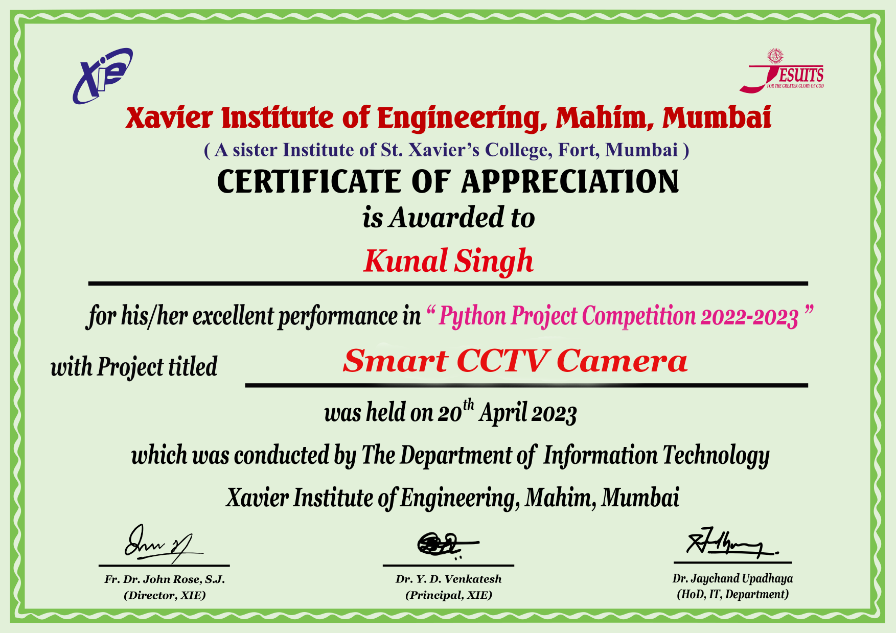

# Smart CCTV Camera

A desktop surveillance control panel built with Python, OpenCV, and Tkinter. Branded under **Kunal's Lab**.

A Smart CCTV Camera is an intelligent surveillance device designed for enhanced monitoring and security. It features a continuous recording system, ensuring that all activity within its range is captured and stored for real-time or later review. With a passerby capturing function, it takes images of individuals as they move through monitored areas, providing clear documentation for security purposes. This system also offers a customizable motion detection feature, allowing users to define a specific area of interest. When movement is detected in this selected region, the system sends alerts, helping focus attention on critical areas.

## Features

- **Monitor** — live motion detection feed using frame differencing; flags "MOTION" or "NO-MOTION" in real time
- **Region Select** — draw a custom region of interest on the live feed to focus motion detection on a specific area
- **Record** — continuous video recording to a timestamped `.avi` file
- **Visitor Log** — detects whether a person is moving left or right across the frame and saves a timestamped photo into `visitors/in/` or `visitors/out/`

## Project Structure

```
Smart_CCTV_Camera/
├── src/
│   ├── main.py          # Tkinter control panel (entry point)
│   ├── motion.py         # Frame-differencing motion detection
│   ├── rect_noise.py      # Region-of-interest selection + detection
│   ├── record.py          # Continuous video recording
│   └── in_out.py          # Visitor direction detection + logging
├── assets/
│   ├── icons/            # UI icons
│   ├── mn.png             # Window icon
│   └── haarcascade_frontalface_default.xml
├── docs/
│   └── award_certificate.png
├── requirements.txt
└── README.md
```

## Installation

```bash
git clone https://github.com/kanenites/Smart_CCTV_Camera.git
cd Smart_CCTV_Camera
pip install -r requirements.txt
```

## Running the App

```bash
cd src
python main.py
```

Press `Esc` to exit fullscreen mode. Each feature window (Monitor, Region Select, Record, Visitor Log) opens its own OpenCV window — press `Esc` inside that window to close it and return to the control panel.

## Required Python Packages

```
opencv-python
pillow
```

## Award

This project won the **Best Python Project Award** at the Python Project Competition 2022-2023, conducted by the Department of Information Technology, Xavier Institute of Engineering, Mahim, Mumbai (held on 20th April 2023).



---

*Built and maintained under Kunal's Lab — AI & ML Systems.*
